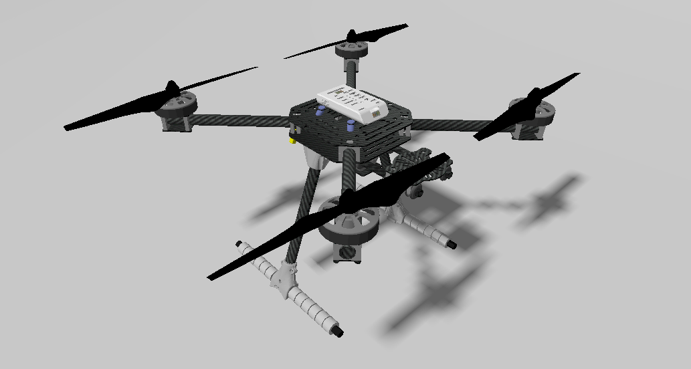
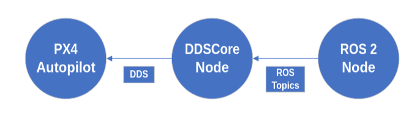

# DDSCore
DDSCore is a ROS 2 Humble package that implements an abstraction layer to make ROS 2 communication with PX4 easier. This proyect is still a WIP.

## Build

## Usage

docker run -it --rm -v /home/bmartinez/ros2_ws/ddscore/workspace:/root/workspace --net=host --env DISPLAY=$DISPLAY --privileged --runtime=nvidia --gpus all prueba