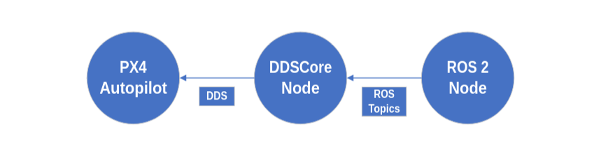

# DDSCore
DDSCore is a ROS 2 Humble package that implements an abstraction layer to make ROS 2 communication with PX4 easier.




This proyect is still a WIP.

## Dependencies

To use the code hosted on this repo, it is required that you use <a href="https://www.docker.com/" target="_blank" rel="noreferrer">Docker</a>. To install Docker Engine, which is the required part, you can find the instructions <a href="https://docs.docker.com/engine/install/ubuntu/" target="_blank" rel="noreferrer">here</a>.

```
# Add Docker's official GPG key:
sudo apt-get update
sudo apt-get install ca-certificates curl
sudo install -m 0755 -d /etc/apt/keyrings
sudo curl -fsSL https://download.docker.com/linux/ubuntu/gpg -o /etc/apt/keyrings/docker.asc
sudo chmod a+r /etc/apt/keyrings/docker.asc

# Add the repository to Apt sources: 
### IMPORTANT: If you use an Ubuntu derivative distro, you may need to use UBUNTU_CODENAME instead of VERSION_CODENAME
echo \
  "deb [arch=$(dpkg --print-architecture) signed-by=/etc/apt/keyrings/docker.asc] https://download.docker.com/linux/ubuntu \
  $(. /etc/os-release && echo "$VERSION_CODENAME") stable" | \
  sudo tee /etc/apt/sources.list.d/docker.list > /dev/null
sudo apt-get update

# Install the Docker packages
sudo apt-get install docker-ce docker-ce-cli containerd.io docker-buildx-plugin docker-compose-plugin

# OPTIONAL Verify that the Docker Engine Installation is sucessful by running the `hello-world` image
sudo docker run hello-world
```

Optionally, you can set the docker commands to be used without the need for ```sudo``` by giving the user clearance.

```
# Create the `docker` group
sudo groupadd docker

# Add your user to the `docker` group
sudo usermod -aG docker $USER

# Log put and log back in or use the following command to activates changes to groups
newgrp docker

# OPTIONAL Re-verify that you can run `docker` commands without sudo
docker run hello-world
```

Another good addition if your computer has an Nvidia GPU is <a href="https://docs.nvidia.com/datacenter/cloud-native/container-toolkit/latest/install-guide.html" target="_blank" rel="noreferrer">Nvidia Container Toolkit</a>. This allows the container made through Docker to use or improve the use of said GPU, but it is not required. If you do <b>NOT</b> use it, please remove ```--runtime=nvidia``` and ```--gpus all``` from the command ```docker run``` found below.

If you do and use <b>APT</b> commands for installation, please use the following commands.
```
# Configure the production repository
curl -fsSL https://nvidia.github.io/libnvidia-container/gpgkey | sudo gpg --dearmor -o /usr/share/keyrings/nvidia-container-toolkit-keyring.gpg \
  && curl -s -L https://nvidia.github.io/libnvidia-container/stable/deb/nvidia-container-toolkit.list | \
    sed 's#deb https://#deb [signed-by=/usr/share/keyrings/nvidia-container-toolkit-keyring.gpg] https://#g' | \
    sudo tee /etc/apt/sources.list.d/nvidia-container-toolkit.list

# Update the package list from the repository
sudo apt-get update

# Install the NVIDIA Container Toolkit packages
sudo apt-get install -y nvidia-container-toolkit

# Configure the container runtime by using the `nvidia-ctk` command
sudo nvidia-ctk runtime configure --runtime=docker

# Restart the Docker daemon
sudo systemctl restart docker
```

## Build

Now that you got the prerequisites and dependencies, you need to clone this repository.

```
git clone https://github.com/SDuSDi/DDSCore.git ros2_ws/ddscore
```

Once you clone it, you have to build the Docker image that comes in it, since all the code is thought out to work on a container. This process takes around 10 minutes to finish.

```
docker build -t bmartinez/ddscore ./ros2_ws/ddscore/.
```

If you wish to use it outside a container, you will have to manually install all the dependencies that are installed through the Dockerfile (use it for reference) and get a few things up in secondary terminals, such as a DDS Agent, the PX4 software, Gazebo Garden and QGroundControl.

## Usage

To run the image as a container, two commands are needed. Be careful with the commands, and check if you may need to remove some options from the ```docker run``` command.

```
# Allow the docker to display in the host's monitor
xhost +local:root

# Run the container in a interactive terminal
docker run -it --rm -v ./ros2_ws/ddscore/workspace:/root/workspace --net=host --env DISPLAY=$DISPLAY --privileged --runtime=nvidia --gpus all bmartinez/ddscore
```